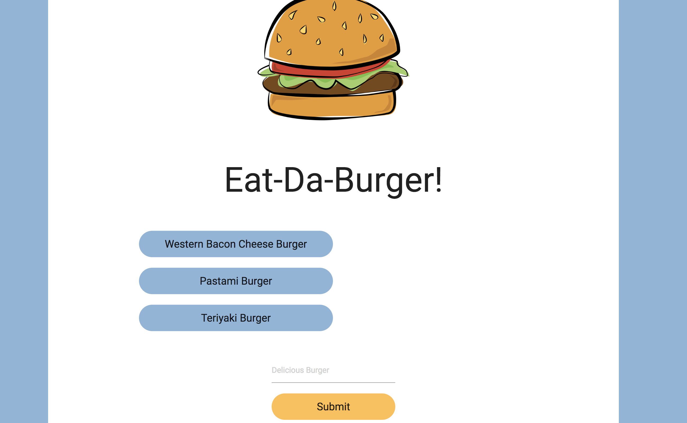

# Eat-Da-Burger

The Eat-Da-Burger application is using HTML/CSS and Materialize for a front end framework. Node.js and Express for the backend. Handlebars is used for templating. 

You can enter a burger name to add it to the page. Then you can click the burger to devoure the burger :) This will move the data in the database. 

## Getting Started
https://toney-eat-da-burger.herokuapp.com/ 

## Screen Shots



## Technologies used
- Node.js
- body-parager NPM Package - https://www.npmjs.com/package/inquirer
- express NPM Package - https://www.npmjs.com/package/express


### Prerequisites

```
- Node.js - Download the latest version of Node https://nodejs.org/en/
- Materialize - Add CDN link to HTML http://materializecss.com/getting-started.html
```

## Built With

* Visual Studio Code - Text Editor
* Materialize - Wireframe
* MySql Workbench - Database

## Authors

* **Toney K** - *HTML/JS/Node.js* - [Toney K](https://github.com/ToneyK)